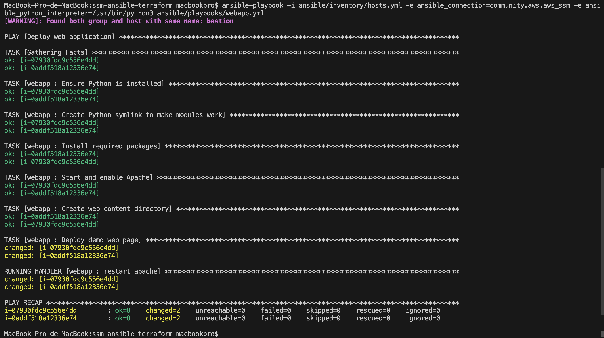
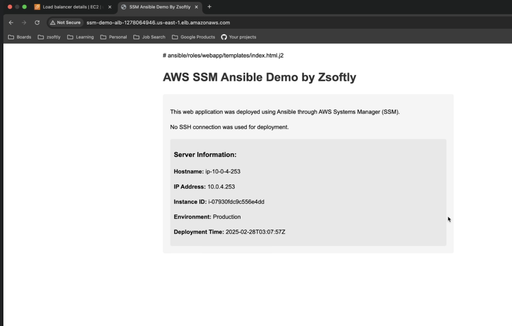

# AWS Infrastructure Deployment with Terraform and Ansible using AWS SSM

## Project Overview
This project demonstrates a secure, scalable AWS infrastructure deployment using Terraform for infrastructure provisioning and Ansible for application configuration, leveraging AWS Systems Manager (SSM) for remote management.

## Prerequisites

### For All Operating Systems
1. **Cloud Providers and Accounts**
   - AWS Account
   - AWS CLI installed and configured
   - AWS IAM user with programmatic access and sufficient permissions

2. **Required Software**
   - Git
   - Terraform (v1.5.0 or later)
   - Ansible (v2.15.0 or later)
   - Python 3.8+
   - pip (Python package manager)
   - Session Manager plugin

### Operating System Specific Setup

#### macOS
```bash
# Install Homebrew (if not already installed)
/bin/bash -c "$(curl -fsSL https://raw.githubusercontent.com/Homebrew/install/HEAD/install.sh)"

# Install required tools
brew install terraform ansible awscli python
pip3 install boto3 botocore
brew install --cask session-manager-plugin
```

#### Ubuntu/Debian
```bash
# Update package lists
sudo apt update

# Install required tools
sudo apt install -y git terraform ansible python3-pip awscli
pip3 install boto3 botocore
curl "https://s3.amazonaws.com/session-manager-downloads/plugin/latest/ubuntu_64bit/session-manager-plugin.deb" -o "session-manager-plugin.deb"
sudo dpkg -i session-manager-plugin.deb
```

#### Windows
1. Install Windows Subsystem for Linux (WSL2)
2. Follow Ubuntu/Debian installation instructions within WSL
3. Alternatively, use Git Bash with Chocolatey package manager:
```powershell
# Install Chocolatey (run as administrator)
Set-ExecutionPolicy Bypass -Scope Process -Force; [System.Net.ServicePointManager]::SecurityProtocol = [System.Net.ServicePointManager]::SecurityProtocol -bor 3072; iex ((New-Object System.Net.WebClient).DownloadString('https://community.chocolatey.org/install.ps1'))

# Install tools
choco install terraform ansible python git awscli

Download the MSI installer from AWS:
 - Visit: https://s3.amazonaws.com/session-manager-downloads/plugin/latest/windows/SessionManagerPluginSetup.exe
 - Run the installer and follow the installation wizard

 # Verify Session Manager Plugin is installed correctly
session-manager-plugin
```

### AWS Configuration
```bash
# Configure AWS CLI
aws configure
# Enter your AWS Access Key ID
# Enter your AWS Secret Access Key
# Enter default region (us-east-1)
# Enter default output format (json)
```

## Project Setup

### 1. Clone the Repository
```bash
git clone https://github.com/ZSoftly/ssm-ansible-terraform.git
cd ssm-ansible-terraform
```

### 2. Create Project Structure
```bash
# Create project directories and files
mkdir -p ansible/inventory ansible/playbooks ansible/roles/webapp/tasks ansible/roles/webapp/templates ansible/roles/webapp/handlers
mkdir -p terraform/modules/network terraform/modules/ec2 terraform/modules/iam

# Create essential files
touch ansible/inventory/hosts.yml \
      ansible/playbooks/webapp.yml \
      ansible/roles/webapp/tasks/main.yml \
      ansible/roles/webapp/templates/index.html.j2 \
      ansible/roles/webapp/handlers/main.yml \
      terraform/main.tf \
      terraform/variables.tf \
      terraform/outputs.tf \
      terraform/modules/network/{main.tf,variables.tf,outputs.tf} \
      terraform/modules/ec2/{main.tf,variables.tf,outputs.tf} \
      terraform/modules/iam/{main.tf,variables.tf,outputs.tf}
```

### 3. Install Ansible Collections
```bash
# Required collections for AWS integration
ansible-galaxy collection install amazon.aws community.aws
```

### 4. Terraform Initialization
```bash
cd terraform
terraform init
terraform validate
```

### 5. Deploy Infrastructure
```bash
# Review changes
terraform plan

# Apply infrastructure
terraform apply -auto-approve
```

### 6. Deploy Web Application
```bash
# Return to project root
cd ..

# Run Ansible playbook
ansible-playbook -i ansible/inventory/hosts.yml \
    -e ansible_connection=community.aws.aws_ssm \
    -e ansible_python_interpreter=/usr/bin/python3 \
    ansible/playbooks/webapp.yml
```


### 7. Accessing the Application
```bash
# Retrieve Load Balancer DNS
cd terraform
terraform output load_balancer_dns
```
- **Accessing in Browser**
 - Copy the DNS name from the CLI output
 - Open a web browser
 - Paste the DNS name into the address bar



## Project Architecture
- **Terraform Modules**:
  - `network`: Creates VPC, subnets, route tables
  - `ec2`: Provisions EC2 instances with SSM agent
  - `iam`: Configures IAM roles and policies

- **Ansible Roles**:
  - `webapp`: Configures web application deployment

## Security Considerations
- Uses AWS Systems Manager for secure, agent-based instance management
- Implements least-privilege IAM roles
- No direct SSH access to instances
- Web application deployed in private subnets

## Troubleshooting
- Ensure AWS credentials are correctly configured
- Verify network connectivity and security groups
- Check SSM agent installation on EC2 instances

## Clean Up
```bash
# Destroy all resources
cd terraform
terraform destroy -auto-approve
```

## Contributing
1. Fork the repository
2. Create your feature branch
3. Commit your changes
4. Push to the branch
5. Create a new Pull Request

## License
This project is licensed under the MIT License

## Contact
- zsoftly@zsoftly.com
- zsoftly.com